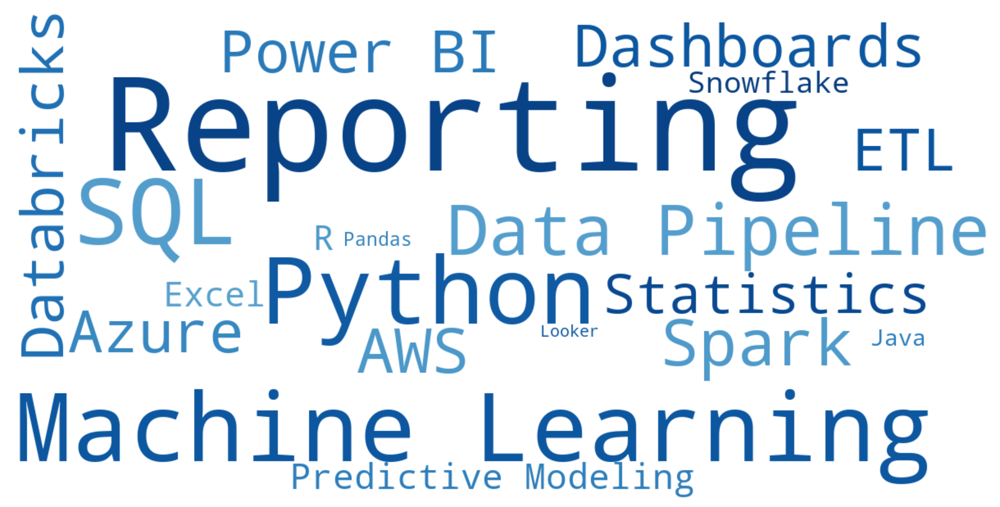
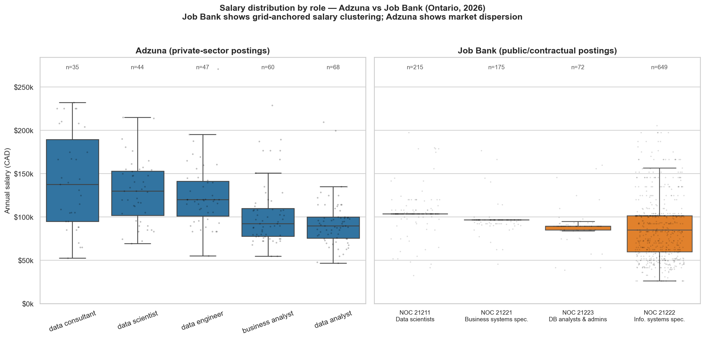
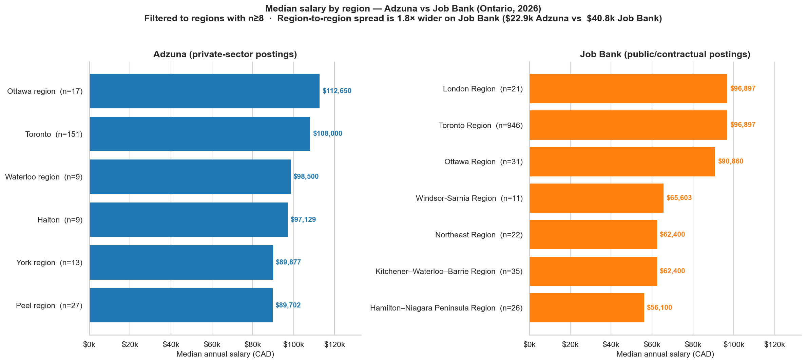
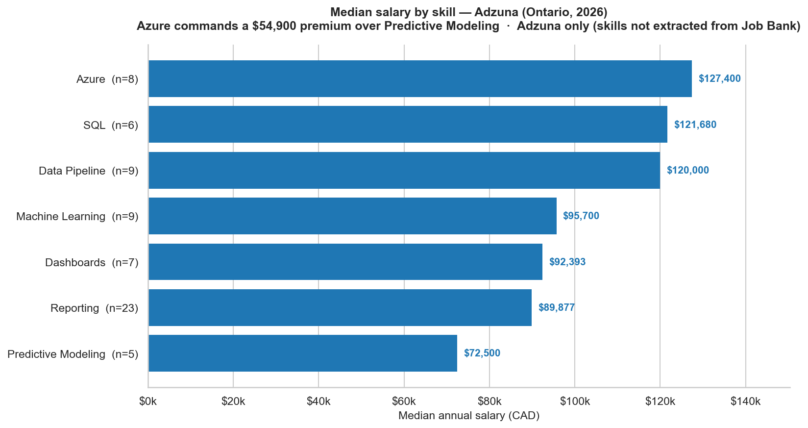

# Mapping the Ontario Data Job Market

This project analyzes 1,369 data job postings across Ontario. Data was collected from two sources: Adzuna's API and Job Bank Open Data (Government of Canada).

## What I Built

This project was built in three steps. First, I queried Adzuna's API using six job title keywords: Data Analyst, Data Engineer, Data Scientist, Data Consultant, Business Analyst, and BI Analyst. Second, on Job Bank, I downloaded three months of data (Feb–April 2026, 147,538 rows) and filtered to Ontario postings under four data-related NOC 2021 codes. Both filters were built on the same hypothesis: that these job titles and NOC codes are most representative of the Ontario data job market.

Before analysis, I standardized salaries (hourly, monthly, or yearly), corrected mislabeled units, and removed outliers to run a cross-source comparison on skills, region, and salary.

## Three Findings That Changed My Job Search Strategy

### Finding 1: Job Bank is two markets in one

When I started exploring Job Bank's salary data, I expected to find a uniform distribution, or one skewed toward the lower end of the salary range. Instead, I found something more interesting. Three of the four NOC codes (representing around 41.5% of the dataset) have a near-zero interquartile range (IQR), clustered around a single salary value:

- 68.8% of Data Scientist postings list a salary of $103,730
- 77.7% of Business Systems Specialist postings list a salary of $96,897
- 62.5% of Database Analyst postings list salaries between $85,280 and $89,471 (a slightly less concentrated pattern)

This is rare in an open labor market, and likely means these are standardized rates set by a federal pay grid covering hundreds of postings. Only the Information Systems Specialists (NOC 21222, representing 58.5% of the dataset) show a genuine market distribution (IQR = $41,465).

For any job seeker scanning Job Bank salary data, this is critical: Job Bank is a combination of two distinct job markets — one driven by a government pay scale, the other operating as an open market.



### Finding 2: After filtering, regional variance is actually wider on Job Bank

After seeing Job Bank's role distribution clustered around standardized rates, I wondered if its regional distribution would be similarly flat. My first hypothesis was that Adzuna — representing the private market — would show wider geographic variance than the public sector.

My first analysis (n≥5 per region) seemed to confirm it: the region-to-region spread was 2.1× wider on Adzuna ($87.1K) than on Job Bank ($40.8K). But that apparent differentiation was driven by a single small-sample outlier — Durham region (n=5 at $176,800), which inflated the Adzuna range artificially. Once I tightened the threshold to n≥8 per region, the picture reversed: Ontario's regional spread is actually **1.8× wider on Job Bank ($40,797) than on Adzuna ($22,948)**.

The real finding: Adzuna's regional medians cluster tightly around $90–$112K — reflecting concentrated private hiring in tech hubs (Toronto, Ottawa, Waterloo) — while Job Bank captures real geographic variance across Ontario, from Toronto Region ($96.9K) down to Hamilton–Niagara ($56.1K).

For a job seeker, this changes the playbook: targeting a tech hub means salary stability and comparability across cities, but stepping outside the hubs — toward Hamilton, Northeast Ontario, or Windsor–Sarnia — means accepting a 30–40% lower median.



### Finding 3: Cloud and SQL beat advanced ML on salary

I wanted to know which technical skills are worth investing time in for someone preparing a data job search in Ontario. So I crossed every Adzuna posting's salary with the skills extracted from its description using regex, keeping only skills mentioned in at least 5 salary-disclosed postings (n≥5).

The ranking is clear: cloud and data engineering skills command the highest medians — Azure at **$127K**, SQL at **$121K**, Data Pipeline at **$120K**. Paradoxically, Reporting — the most frequently mentioned skill of all (n=23) — sits near the bottom at **$89,877**. A universally expected skill that commands no salary premium. Predictive Modeling brings up the rear at **$72K**, though with only n=5 postings, that gap should be read with caution.

For my own positioning as a data consultant, this points to a clear training priority: a cloud certification (Azure) and SQL fluency offer structurally higher premiums than advanced ML specialization — at least in the current Ontario data market.



## Methodology

A few methodological choices shaped how these findings were produced. I'm documenting them here so a reader can understand the thought process or replicate the analysis.

### Cross-source juxtaposition (no merging)

I deliberately chose not to merge the Adzuna and Job Bank datasets. The two sources use different taxonomies — Adzuna uses job titles aligned with private-sector recruiter language (Data Analyst, BI Analyst, etc.), while Job Bank uses Canada's NOC 2021 codes (21211 Data Scientists, 21222 Information Systems Specialists, etc.). Forcing a one-to-one mapping between the two would have introduced noise and possibly bias without analytical gain. Instead, I present both datasets side by side and let the comparison speak for itself.

### Sample-size thresholds

I applied two minimum thresholds depending on the analysis:

- **n≥5 per group** for role-level and skill-level analyses (the minimum for a publishable median).
- **n≥8 per group** for regional analysis, after observing that Durham region (n=5, median $176,800) was artificially inflating Adzuna's regional spread. Raising the threshold to n≥8 removed this small-sample outlier and reversed Finding 2's conclusion.

Tightening the threshold cost me four Adzuna regions but produced a more honest comparison.

### Salary standardization

Job Bank salaries arrived in three units (Hour, Month, Year), with some postings mislabeled — yearly values stored as hourly, hourly values stored as yearly. I corrected unit labels using plausibility heuristics (a yearly value under $20K is almost certainly hourly; an hourly value above $300 is almost certainly yearly), annualized everything to a single comparable scale, and filtered out values outside a plausible range of $25K–$500K annual. This left 1,111 Job Bank postings with usable salary data out of 1,113.

### Hypothesis testing

I tested one explicit hypothesis during the regional comparison: that Job Bank would capture more federal government jobs in Ottawa than Adzuna would. The data falsified it — Ottawa accounts for 6.6% of Adzuna's Ontario postings versus only 2.8% of Job Bank's. I mention this here because it's a useful reminder that public-data sources are not necessarily more "public-sector heavy" than private aggregators.

## What I'd Do Differently

This project is a snapshot, not a finished product. A few improvements would meaningfully strengthen the analysis in a future iteration.

### Richer skill extraction

The current regex-based extractor caught at least one skill in only 28% of Adzuna postings (288 of 1,025 with descriptions long enough to scan). LLM-based extraction would likely raise coverage to 80–90%, capturing emerging tools, framework versions, and soft skills that don't appear in a fixed keyword dictionary. I stayed with regex for this iteration to keep the pipeline transparent and reproducible — but the coverage gap is the project's biggest data-quality bottleneck.

### Federal government coverage

Neither Adzuna nor Job Bank likely captures the full federal hiring market. Adding a third source — for example, the official Government of Canada job portal at jobs.gc.ca — would clarify whether the salary "anchors" observed in Finding 1 (e.g., $103,730 covering 68.8% of Data Scientist postings) come from federal pay grids specifically, or from a wider mix of public-sector contracts.

### Larger sample on the skill × salary intersection

Only 61 Adzuna postings had both a disclosed salary and at least one extracted skill, which limited Finding 3 to seven publishable skills. Extending the collection from one month to six months could multiply this intersection by roughly 4–6×, opening the door to finer cross-cuts (skill × region, skill × role) and to a credibility test for the small-sample skills (Predictive Modeling currently sits on n=5).

## How to Reproduce

The full analysis can be reproduced in about 15 minutes once the data is in place.

### 1. Clone the repo

```bash
git clone https://github.com/PetiteReb/toronto-data-job-market-analysis.git
cd toronto-data-job-market-analysis
```

### 2. Set up the Python environment

```bash
python -m venv venv
.\venv\Scripts\Activate.ps1    # Windows PowerShell
# source venv/bin/activate     # macOS / Linux
pip install -r requirements.txt
```

### 3. Configure Adzuna API credentials

Get free credentials at [developer.adzuna.com/signup](https://developer.adzuna.com/signup), then:

```bash
cp .env.example .env
# Edit .env with your ADZUNA_APP_ID and ADZUNA_APP_KEY
```

### 4. Collect Adzuna data

```bash
python src/02_collect_adzuna_jobs.py
```

This queries Adzuna's API across the six job title keywords and saves the raw JSON to `data/raw/adzuna_jobs.json`.

### 5. Download Job Bank Open Data

The Job Bank CSV files are not included in this repo (~131 MB combined). Download the three monthly files manually from the [Government of Canada Open Data Portal](https://open.canada.ca/data/en/dataset/ea639e28-c0fc-48bf-b5dd-b8899bd43072):

- `job-bank-open-data-all-job-postings-en-feb2026.csv`
- `job-bank-open-data-all-job-postings-en-mar2026.csv`
- `job-bank-open-data-all-job-postings-en-apr2026.csv`

Place them under `data/raw/jobbank/`.

### 6. Run the notebooks in order

The notebooks are designed to be run sequentially. Each one produces inputs for the next:

| Notebook | Purpose |
|----------|---------|
| `01_data_exploration.ipynb` | Inspect raw Adzuna data, produce `adzuna_jobs_cleaned.csv` |
| `02_skills_extraction.ipynb` | Extract skills via regex, produce `adzuna_jobs_with_skills.csv` |
| `03_salary_analysis.ipynb` | Adzuna salary analysis by role, city, and skill |
| `04_jobbank_exploration.ipynb` | Filter Job Bank to Ontario data jobs, standardize salaries, produce `jobbank_ontario_data_clean.csv` |
| `05_combined_salary_analysis.ipynb` | Cross-source aggregations (role / region / skill) |
| `06_visualization.ipynb` | Generate three hero charts (boxplot by role, bar chart by region, bar chart by skill) |
| `07_polish_and_extra_viz.ipynb` | Generate the skills wordcloud and final polish on figures |

Open them in Jupyter or VS Code and run cells top-to-bottom.

## Tech Stack

- **Language**: Python 3.14
- **Data collection**: `requests`, `python-dotenv`
- **Data processing**: `pandas`, `numpy`, `pathlib`, `ast`
- **Skill extraction**: regex (`re` module)
- **Visualization**: `matplotlib`, `seaborn`, `wordcloud`
- **Notebooks & version control**: Jupyter, Git, VS Code

## Project Structure

```
toronto-data-job-market-analysis/
├── assets/                         # PNG charts displayed in this README
├── data/
│   ├── raw/                        # Raw API responses (JSON) and Job Bank CSVs (gitignored)
│   └── processed/                  # Cleaned datasets (CSV)
├── notebooks/                      # 7 Jupyter notebooks (see How to Reproduce)
├── outputs/                        # Aggregated CSVs and figures from analysis
├── src/
│   ├── 01_fetch_adzuna.py          # API connectivity test
│   └── 02_collect_adzuna_jobs.py   # Main Adzuna collection pipeline
├── .env.example                    # Template for API credentials
├── README.md
└── requirements.txt

## About Me

I'm Rebecca Olivier, a Data & Analytics Consultant currently building BI dashboards and ETL pipelines at Square Management (on the Airbus account), with prior experience in data governance (Thales) and aerospace project management (Bombardier). I'm a Canadian citizen currently based in Toulouse, France, and I built this project to understand the Ontario data job market before relocating.

I'm open to **Data Analyst, BI Analyst, or Data Consultant roles in Ontario** (Toronto, Ottawa, or remote). No work permit required.

**Contact**
- LinkedIn: [linkedin.com/in/rebeccaolivier-](https://linkedin.com/in/rebeccaolivier-/)
- Email: rebecca.olivier28@gmail.com